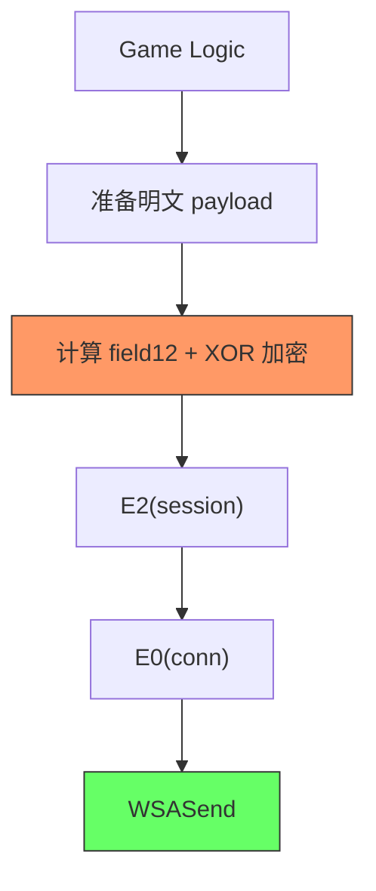

# 街头篮球 FreeStyle 逆向进度 — 2026-05-18

> ⏳ **已归档** — 信息已提取到 01_知识库 / 02_试验记录 / 03_常量地址表


## 一、已验证通过的项目

### 1.1 ApolloCT CRC Patch + 游戏启动 ✅
- ApolloCT.dll 加载后 patch 两个 CRC 校验点 (`+0x1A3C54`, `+0x1BE222` → `xor eax,eax; ret`)
- `apollo_launcher.py` / `auto_login_v3.py` 均能稳定启动

### 1.2 Frida 附加 + WSASend 捕获 ✅
- `frida_decrypt_hooks.js` 已工作 — 捕获所有 WSASend/WSARecv
- 游戏包通过 magic header `43 d5 8b 80 c4 74 8a db 00 01 7c 39` 识别

### 1.3 协议包结构 ✅
```
┌──────────────┬──────────┬──────────┬────────────────────┐
│  12 bytes    │ 4 bytes  │ 4 bytes  │    N bytes         │
│  magic固定值  │ field12  │  seq LE  │  XOR加密的payload   │
└──────────────┴──────────┴──────────┴────────────────────┘
```

### 1.4 XOR 加密密钥 ✅
```
key = 4d b8 a8 54  (4 字节循环)
```
- 通过登入包中的填充模式推断
- 密码 `880234dan` 解密验证通过 → 确认密钥正确
- `xor_decoder.py` 可完整解密协议包

### 1.5 函数入口定位 ✅
通过 WSASend backtrace → 反向扫描函数序言 `push ebp; mov ebp,esp`，定位到两个关键函数：

| 函数 | 地址(偏移) | 角色 |
|------|-----------|------|
| **E0** | FreeStyle.exe+0x20479D0 | WSASend 直接调用者 (发包 wrapper) |
| **E2** | FreeStyle.exe+0x2038B80 | E0 的调用者 (session 层函数) |

调用链: `GameLogic → ... → E2(sessionObj) → E0(connObj) → WSASend`

**E0 参数：**
- ecx = connObj (结构体内含 socket handle 如 0xbc8)
- edx = sessionObj
- 栈 arg[0] = connObj, arg[1] = sessionObj (冗余 push)

**E2 参数：**
- ecx = sessionObj (结构体内含本地 IP "192.168.3.2")
- edx = 每包变化的值 (如 0x6302, 0x17d3 etc.)
- 栈 arg[0] = sessionObj

---

## 二、当前卡点

### 2.1 ❌ E0/E2 无法通过 Frida NativeFunction 直接调用

尝试了 **cdecl** / **fastcall** / **thiscall** 三种调用约定，全部崩溃：

| 约定 | 错误 |
|------|------|
| cdecl (默认) | `access violation accessing 0x4` |
| fastcall | `access violation accessing 0x0` |
| thiscall | `access violation accessing 0x0` |

**根因分析：**

E0/E2 不是纯函数，它们依赖：
1. **内部对象状态** — connObj (0xa1ea200) 和 sessionObj (0x276d7020) 是运行时堆对象，Frida RPC 线程调用时，这些对象内的某些指针字段为 NULL → 解引用崩
2. **线程上下文** — Frida RPC 运行在独立线程，游戏主线程的 TLS/栈上变量不可用
3. **前置调用** — E2 需要调用者先准备好加密后的 buffer 再传入，直接调 E2 缺少这一步



**我们 Hook 成功的是 E0 和 E2 的入口，但加密操作发生在其上层的 "准备明文 + 加密" 阶段，这一层尚未定位。**

### 2.2 ❌ field12 算法未知

- CRC32 / Adler32 / 简单求和 → 全部不匹配
- XOR key `4d b8 a8 54` 在代码段中未搜索到 4 字节立即数（0 命中）
  - key 可能是动态构造的（逐字节 xor 或复合算法）

### 2.3 ❌ XOR key 扫描失败

```
Memory.scan 代码段搜索 0x54A8B84D: 0 hits
Memory.scan 代码段搜索 0x808BD543: 0 hits
```

说明 key 和 magic 都不是以 4 字节 dword 常量形式出现在代码中 —— 可能是逐字节构造或通过数据段引用。

---

## 三、可行路径

### 方案 A: UI 自动化（已实现）⭐

`auto_login_v3.py` 通过 SendMessage/PostMessage 模拟键盘输入，绕过所有网络层逆向：

```powershell
py auto_login_v3.py --launch
```

**优点**：零额外逆向成本，直接可用  
**局限**：不是网络层方案，依赖游戏窗口存在

---

### 方案 B: 绕过 field12 发包（最简路径）

不计算 field12，直接在 WSASend onEnter 替换 buffer：

1. 备份游戏原始包（保留 field12）
2. XOR 解密 payload → 替换为我们自己的数据 → XOR 加密 → 写回 buffer
3. 保持 magic + field12 + seq 不变，只改 payload

**试验思路**：
```
原始: magic | field12_orig | seq | XOR(payload_orig)
替换: magic | field12_orig | seq | XOR(payload_our)
```

如果服务端接受 → field12 不依赖 payload → 可以直接网络发包  
如果服务端拒绝 → field12 依赖 payload → 需要下一步

---

### 方案 C: 动态追踪加密过程

不 hook 函数入口，而是监控内存写入：

1. 在 WSASend onEnter 拿到 game buffer 地址
2. 下一个包时，在 WSASend 前使用 `Process.setExceptionHandler` 或 `MemoryAccessMonitor`
3. 捕获谁写了 game buffer → 找到加密函数

**技术复杂度**：中，需要 handle 内存页保护或硬件断点

---

### 方案 D: 逆向加密函数（深度方案）

已知函数入口搜索范围在 E2 之上。可以：
1. 对 E2 的调用者（depth=3,4,5...）重复反向序言扫描
2. 找到 E2 调用者的函数入口
3. Hook onLeave → 检查是否修改了 sessionObj 内部 buffer → 找到明文→密文转换点

---

## 四、当前文件清单

| 文件 | 用途 | 状态 |
|------|------|------|
| `auto_login_v3.py` | UI 自动化登录 | ✅ 可用 |
| `apollo_launcher.py` | 启动游戏 + CRC patch | ✅ 可用 |
| `xor_decoder.py` | XOR 解密协议包 | ✅ 可用 |
| `frida_decrypt_hooks.js` | WSASend/Recv 抓包 | ✅ 可用 |
| `apollo_launcher_capture.py` | 启动 + 抓包 | ✅ 可用 |
| `find_encrypt.py` | 启动 + 追踪调用栈 | ✅ 可用 |
| `find_send_func.py` | 自动定位函数入口 | ✅ 可用 |
| `call_game_func.py` | Frida RPC 调 E0/E2 | ❌ 崩溃 |
| `find_xor_key.py` | 搜索 XOR key 常量 | ✅ 0 hits |
| `analyze_candidates.py` | 反汇编加密候选 | ✅ 无 XorData |
| `frida_rpc.js` | JS RPC 接口 | ❌ NativeFunction 崩溃 |

---

## 五、下步建议

1. **短期可用** → `auto_login_v3.py` 已能登录
2. **字段验证** → 方案 B，WSASend 替换 payload 测试 field12 是否依赖 payload
3. **根本解决** → 方案 C 或 D，精确定位加密函数

---

## 六、补充发现（5.19 后续）：Apollo 三层防御结构

通过 x64dbg 附加尝试，确认 Apollo 是**三层**防御，不仅只有 ApolloCT.dll：

```
第 1 层 — Apollo.sys (内核驱动)           ← 之前未知
├─ KdDisableDebugger / 线程回调 / DR 寄存器清除
├─ 通过 sc stop + sc config disabled + 文件重命名处理 ✅

第 2 层 — ApolloCT.dll (独立 DLL)         ← CRC patch 已处理 ✅
├─ CRC_RVA1=0x1A3C54, CRC_RVA2=0x1BE222 → 33 C0 C3
├─ 磁盘 patch 已打

第 3 层 — FreeStyle.exe 内嵌 Apollo 代码    ← 之前未知 ❌
├─ 内存段 0x2C14000-0x2CFC000，加密/打包
├─ 运行时解密 → 检测调试器 → 重定向EIP到垃圾数据 → 崩溃
├─ 无法静态 patch（代码在运行时才解密）
└─ 这是之前"无限自动下断"和"patch后压根断不了"的根因
```

**结论：x64dbg 任何形式附加都会触发第 3 层防御崩溃游戏。**